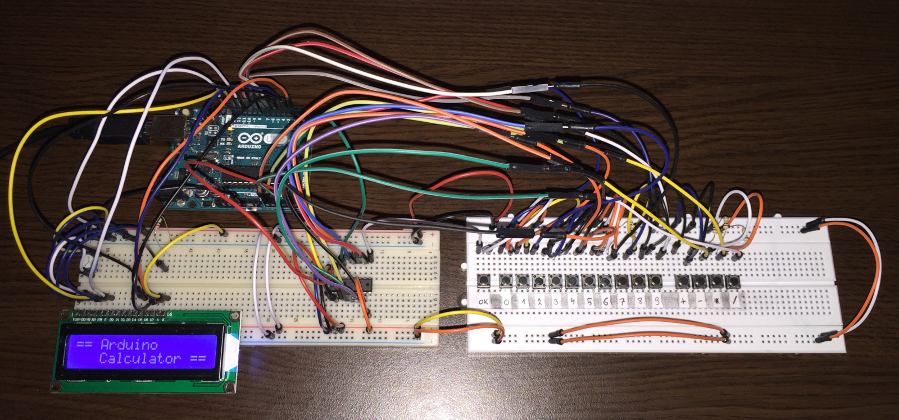
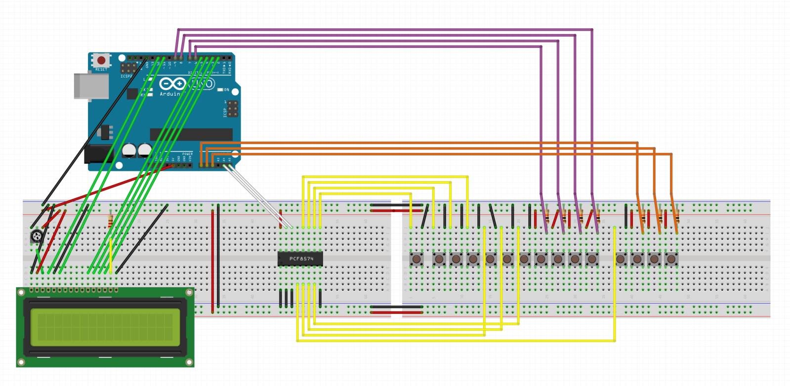
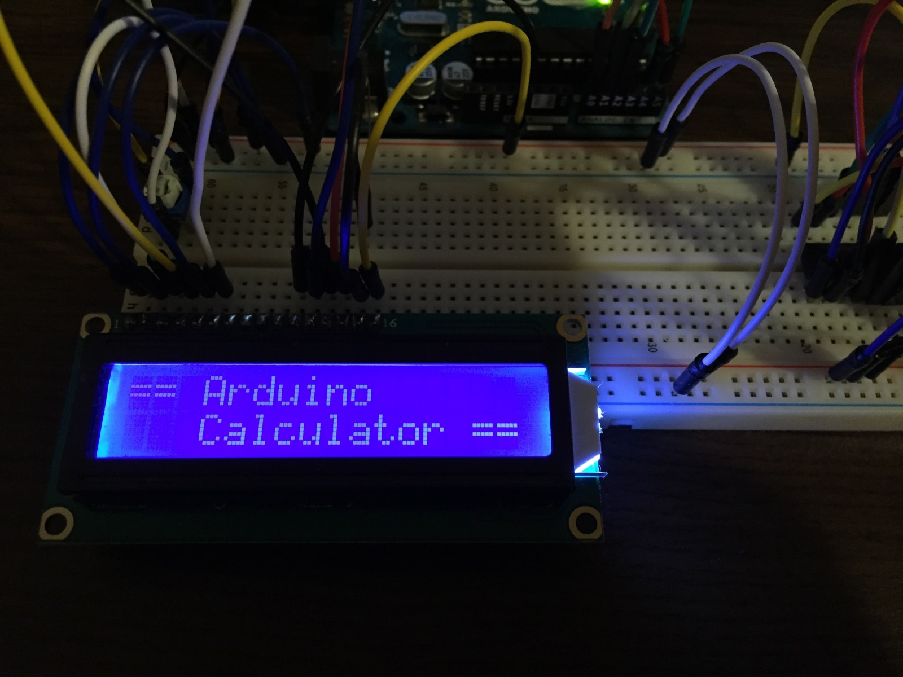
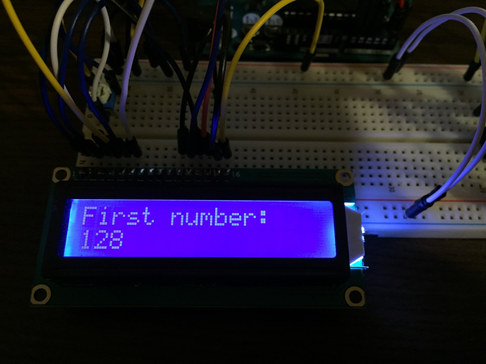
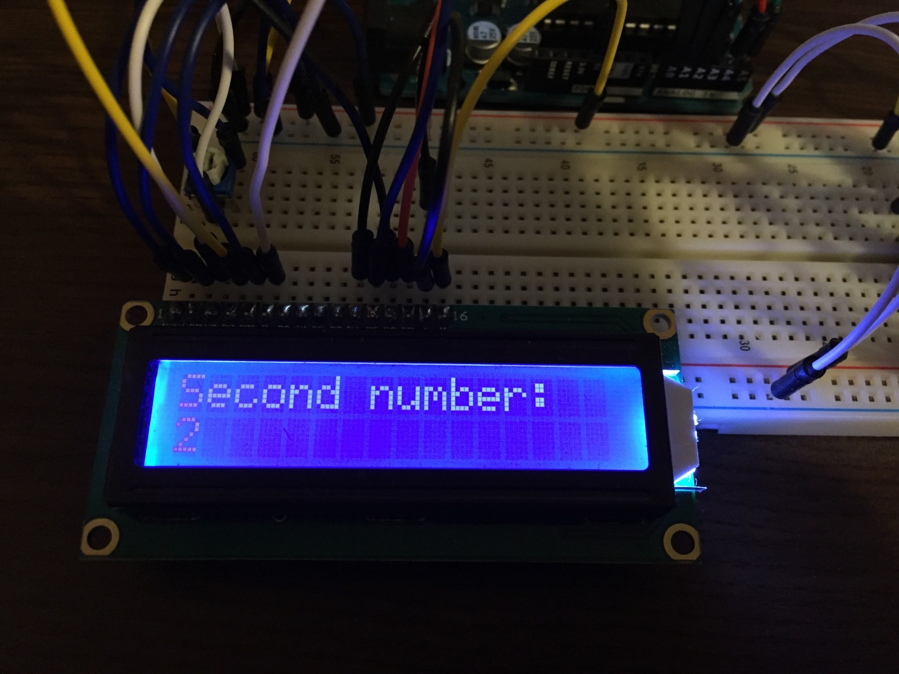
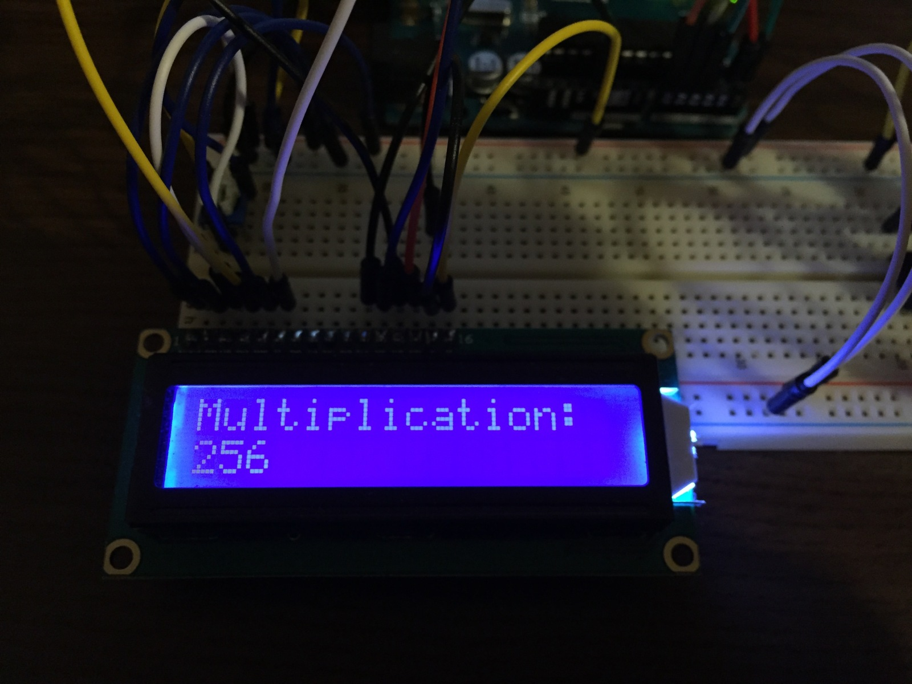

# ArdCalc - Arduino Calculator

Simple calculator with four basic operations based on Arduino Uno.

<h2>What you need to make it?</h2>

<ul>
  <li>Arduino board (ATmega328)</li> 
  
  <li>LCD Screen (compatible with Hitachi HD44780 driver)</li>
  <li>10k ohm potentiometer</li>
  <li>220 ohm resistor</li> 

  <li>PCF8574 expander</li> 
  
  <li>15x pushbuttons</li>
  <li>7x 10K ohm resistors</li>
</ul>

<h2>Wiring</h2>

<h2>How it works?</h2>

In the beginning we see „Arduino Calculator”. To start typing the first number, press „OK”. 
After typing the number, choose one of the four basic operations mentioned below:
<ul>
<li>` + ` - addition</li>
<li>` - ` - subtraction</li>
<li>` * ` - multiplication</li>
<li>` / ` - division</li>
</ul>

After typing the second number, press „OK” to show the result. 
If you want to reset the calculator, press "OK" again.   

In order for ArdCalc to work correctly, I had to add some limitations:

1. If one of the numbers entered is greater than 999999, you will see "error” on the display. 
2. If you try to divide by zero, you will see „inf” ( „infinity” ) on the display.
